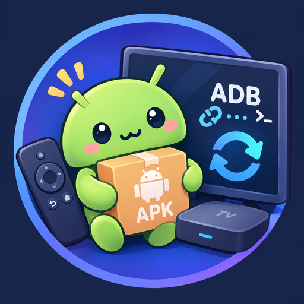

# 📺 TV APK Sync

> English page. 简体中文见 [README.md](./README.md).

<p align="center"></p>

A local web console for Android TV and projectors. It checks one GitHub release line, or one direct APK link, once a day.


## 📖 Overview

Save a device, a name, and a link. The apps page can import several local APKs at once. Cached files can be downloaded, deleted, or pushed. Installed apps can be stopped, cleared, disabled, or removed. Processes are sorted by memory. Offline devices show "offline" on those pages.

## 🚀 Quick Start

The TV needs developer options, USB debugging, and network debugging on port `5555`. The machine running Docker must be on the same LAN.

```bash
mkdir -p /volume1/docker/tv-apk-sync/data
docker pull lzylipu/tv-apk-sync:latest
docker run -d \
  --name tv-apk-sync \
  --restart unless-stopped \
  --log-opt max-size=10m --log-opt max-file=3 \
  -e TZ=Asia/Shanghai \
  -p 8088:8080 \
  -v /volume1/docker/tv-apk-sync/data:/data \
  lzylipu/tv-apk-sync:latest
```

Change `/volume1/docker/tv-apk-sync/data` to your own directory. Open `http://HOST:8088`.

| Flag | Meaning |
|---|---|
| `-p 8088:8080` | Browser uses 8088. The page inside the container listens on 8080 |
| `-v .../data:/data` | Config, logs, and downloaded APKs. Removing the container does not delete them |
| `-e TZ=Asia/Shanghai` | Log time is Beijing time |
| `-e GITHUB_TOKEN` | Private GitHub repositories only. Leave it out for public ones |

The first start writes `config.yaml` in that directory. Add the TV address, the app link, and a notice in the page. You do not edit the file by hand.

The notify page exports and imports that same YAML file. Imported values stay in the form until you press save. Uploaded APKs go directly under `apk/`. The log page shows the latest 50 lines, newest first.

`docker compose up -d` from a clone does the same port and volume mapping: `8088:8080` and `./data:/data`.

Version checks use the interval set on the notify page. A package already downloaded is installed on the next device check while the TV is on.

## ⚙️ Configuration

| Field | Meaning |
|---|---|
| `apps[].source` | `owner/repo`, a GitHub URL, or a direct `.apk` URL |
| `pull_hours` | How often to look for a new version. Default 24 |
| `install_minutes` | Device check interval from the notify page. Status refresh and installs both use it |
| `GITHUB_TOKEN` | Private repositories only. Set it in the environment |

A GitHub release URL is tracked by filename shape. `1.8.1` changing to `1.8.2` stays on the same line. A non-GitHub URL downloads that one file only.

## 📄 License

[MIT](./LICENSE)
